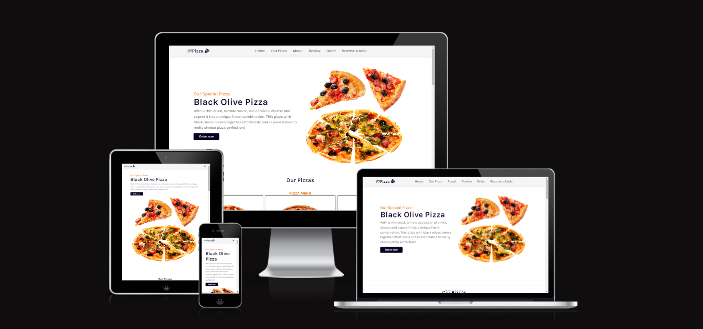
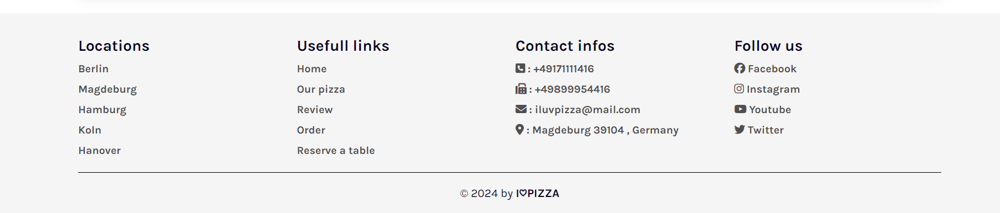

# I♡Pizza
***
I Love Pizza is a website for pizza lovers, where they can place orders for free delivery to their residential address or book a table for them to spend some funny time at our restaurant. I Love Pizza focuses a lot on the quality of the pizza provided to the customer and on making him happy and satisfied.

The live link can be found here : https://sahlaouiahmed.github.io/FirstProject/

The website is an interface between us and our customers, as it displays all the types of our pizza. Our most requested pizza, all other types of pizza, a "About us" section, a section for customer comments, a section for orders and a section to book a table if the customer wants to visit us and enjoy our most delicious pizzas.

## Features
***
#### Navigation Bar :
The navigation bar enables the user to navigate between sections of the website smoothly , as each element contains a link that takes the user user to its own section or page.

---------------

#### Home :
The home section displays the most popular pizzas, a name with a short description.
The user can place an order and this will take him to the order form to fill it and submit his order.

For the pagination , I have used a a javascript code from https://swiperjs.com/

---------------

#### Our Pizza :
In this section , the user can find all our pizza , their prices and can also place an order.

----------------

#### About us :
In this section , a short description about and some reasons why should pizza-lovers choose us , such as the free delivery , easy payments , 24/7 service.

----------------

#### Review section :
In this section , the website visitors can find the reviews of some of our custumors , thier feedback about our pizza and our service.

For the pagination , I have used a a javascript code from https://swiperjs.com/

-----------------
#### Order section: 
In this section the customer can place an order by filling the form ( Name , last name , phone number , pizza size , address ....)

Once the customer has filled the form and submitted it , he will recieve a confirmation message of his order :

-----------------
#### Reserve a table :
In this section the customer can reserve a table by filling the form ( Name , last name , phone number , email , address ....)

Once the customer has filled the form and submitted it , he will recieve a confirmation message of his reservation :

-----------------
#### Footer :
The footer contains : 

1. Locations
2. Usefull links
3. Contact infos
4. Social medias links 

------------------

## Testing
I tried to do a lot of test to make sure everything working as expected.
1. Testing all the links.
2. Testing order and rservation forms.
3. Testing the good functioning of the site on all types of devices ( phone , tablet and desktop ).
4. Testing all images and files paths.
5. Testing the good functioning of the site on all browsers (Chrome, Firefox, Opera, Safari & Co)

I tired too to make sure that my HTML and CSS codes contain 0 errors by using https://validator.w3.org/ and https://jigsaw.w3.org/css-validator/

#### bugs

#### Validator Testing
* HTML : No errors were returned when passing through the official W3C validator https://validator.w3.org/ .
* CSS : No errors were found when passing through the official Jigsaw validator https://jigsaw.w3.org/css-validator/ .

-----------------

## Deployment 

* The site was deployed to GitHub pages. The steps to deploy are as follows:
    * In the GitHub repository, navigate to the Settings tab
    * From the source section drop-down menu, select the Master Branch
    * Once the master branch has been selected, the page will be automatically refreshed with a detailed ribbon display to indicate the successful deployment.

The live link can be found here - https://sahlaouiahmed.github.io/FirstProject/

------------------

## Credits

#### Contents

* Instructions on how to write some css and html codes were taken from https://www.youtube.com/ and https://www.w3schools.com/ .
* Instructions on how to make website responsive were taken from some YouTube tutorial.
* The javascript codes for paginations were taken from https://swiperjs.com/ .
* The icons were taken from https://fontawesome.com/ .

#### Media

* All the photos used on the website are from open websites .