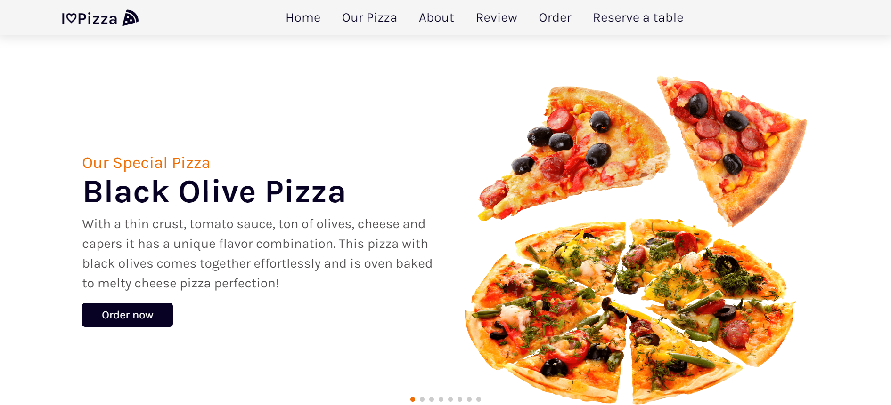

# I♡Pizza
***
I Love Pizza is a website for pizza lovers, where they can place orders for free delivery to their residential address or book a table for them to spend some funny time at our restaurant. I Love Pizza focuses a lot on the quality of the pizza provided to the customer and on making him happy and satisfied.

The website is an interface between us and our customers, as it displays all the types of our pizza. Our most requested pizza, all other types of pizza, a "Why choose us" section, a section for customer comments, and a section for orders and a section to book a table if the customer wants to visit us and enjoy the most delicious pizzas.

# Features
***
### Navigation Bar :
Tne navigation bar enables the user to navigate between sections of the website smoothly , as each element contains a link that takes the user user to its own section or page.

---------------

### Home :
The home section displays the most popular pizzas, a name with a short description.
The user can place an order and this will take him to the order form to fill it and submit his order.

For the pagination , I have used a a javascript code from https://swiperjs.com/

---------------

### Our Pizza :
In this section , the user can find all our pizza , their prices and can also place an order.

----------------

### About us :
In this section , a short description about and some reasons why should pizza-lovers choose us , such as the free delivery , easy payments , 24/7 service.

----------------

### Review section :
In this section , the website visitors can find the reviews of some of our custumors , thier feedback about our pizza and our service.

For the pagination , I have used a a javascript code from https://swiperjs.com/

-----------------
### Order section: 
In this section the customer can place an order by filling the form ( Name , last name , phone number , pizza size , address ....)

Once the customer has filled the form and submitted it , he will recieve a confirmation message of his order :

-----------------
### Reserve a table :
In this section the customer can reserve a table by filling the form ( Name , last name , phone number , email , address ....)

Once the customer has filled the form and submitted it , he will recieve a confirmation message of his reservation :

-----------------
### Footer :

